# Relocation assistant - ML based helper for those looking to relocate to Los Angeles County

## Business Problem  
People often relocate to a different area for various reasons. The reason why people move are varied, and the following graphics shows some of the top reasons.

[source: [us-moving-statistics-for-2019](https://www.moving.com/tips/us-moving-statistics-for-2019/)]

[This article based on a survey](https://www.allied.com/infographic/job-relocation-survey) outlines more reasons and factors that govern the job related relocation, and what people look for.

As part of their relocation plans it becomes important for people to explore the area. When people live far away from the places to which they are seeking relocation, it becomes expensive to undertake travel and personally explore the area. Even though the final decision will require them to travel, it will make a lot of sense for them to use a resource (like an application like this, or a human consultant) that can provide useful suggestions about the area and the neibourhood. 

For example, people may want to find out places closer to the schools or shopping malls, or beaches. Individual requirements vary, and hence it will be helpful to have an application that can suggest areas, and also indicate possible cities / neighbourhoods to look for, from the standpoint of efficient exploration. 

Crowd sourcing is one of the best ways to see what kind of people relocate and for what reasons, and how their reasons influence the choice of their neighbourhoods. Some of the criteria are outlined in [this article](https://www.urbanbound.com/blog/crowdsourcing-mobility-the-most-valuable-relocation-data-is-closer-than-you-think)  

This notebook implements **a subset of the requirements** of a typical relocation assistant, by pulling geographical information about LA county and adding additional data for the users to query and decide the location to visit for relocation. For example and illustration, this assignment uses the shooting incidents in LA county as one form of criminal episodes to enrich the dataset.

This notebook, though not a full fledged application, provides a simple prototype for the analytics part of an application. While things like persistence, deploymet, GUI are outside the scope of this exercise, the trained model in this notebook can be deployed and used with real data for a real life application. 

Due to paucity of data available to construct a complete application, this prototype uses selected variables where the data is more or less complete.

## Datasets Used:

- la_county_zipcodes = "https://namecensus.com/igapo/zip_codes/counties/alpha/Los Angeles County-California1.html"
- shooting_incident_report = "https://data.lacounty.gov/Criminal/All-Shooting-Incidents-for-Deputy-Involved-Shootin/d5zc-33fr"
- Zipcode 1 = "https://namecensus.com/igapo/zip_codes/counties/alpha/Los%20Angeles%20County-California1.html"
- Census = "https://catalog.data.gov/dataset/2010-census-populations-by-zip-code"
- Population by Zipcodes = "https://www.zip-codes.com/city/ca-los-angeles.asp
- Latitude / Longitude = "https://gist.githubusercontent.com/erichurst/7882666/raw/5bdc46db47d9515269ab12ed6fb2850377fd869e/US%2520Zip%2520Codes%2520from%25202013%2520Government%2520Data"
- http://download.geonames.org/export/zip/ (downloaded the USZipcodes.zip)  

## Additional datasets referred but not used  

- wikipedia_la_cities = "https://en.wikipedia.org/wiki/List_of_cities_in_Los_Angeles_County,_California"
- Zipcode 2 [not used] = "https://www.laalmanac.com/communications/cm02_communities.php"

## Data Preperation

The essential step of any ML based study is preparation of data. This is key especially when the dataset is sourced from an uncontrolled source such as public data sources. In this case, the followoing data preparation steps were carried out.

  + Removal missing values: Since there is no column or row can be omitted here, and since there is no easy way to impute the missing values, the incomplete rows were dropped in a dataset from a single source. The variables of interest are things like zipcode, latitude, longitude, demographic information such as mean household age, number of males, females etc, population, and shooting incidents. None of these can be easily guessed, or meaningfully interpolated from other values. For instance the population in a zipcode does not have to be similar or more or less than a nearest zipcode; neither does the shooting incidents etc. Since conceptually it is meaningless to pad values this way, a two pronged approach was taken as described below, to deal with rows that are incomplete in a given dataset. 
    * Dropping incomplete rows: Drop the rows (for zipcodes) that have missing values in the required columns
    * Replace with rows from another dataset: Find another public dataset from a different source, that may contain the data for this row (identified by the zipcode) merging both to form a more complete dataset.
    
  + Duplicates:  The duplicates are unavoidable in a public dataset, and especially when crowd sourced datasets are merged together. These duplicates are filtered out by simple removal of the second and following records. An example is shown below
  
  [The following screenshot](!../../images/duplicates_illustration.png) shows the number of rows (980) in a dataframe that contains duplicates and inconsistent entries. There are multiple entries with value `Los Angeles (Wilshire Center)`. And there are entires with inconsistent names such as `Los Angeles (Southeast Los Angeles)` and `Southeast Los Angeles (Los Angeles)` while indicating the same zipcode.
  
  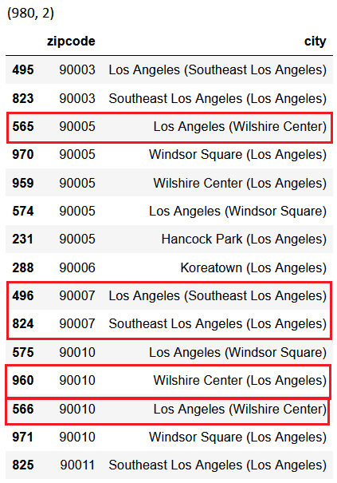
  
## Feature Engineering

Multiple datasets are brought together as outlined in the dataset filed of this report earlier. These datasets are cleansed, merged to form a more complete and unified dataset after the removal of the duplicates. The following screenshot shows the merging of multiple datasets

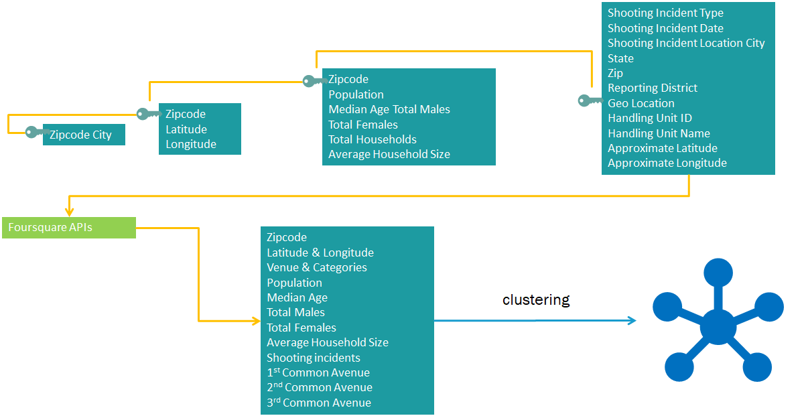

In the merged dataset, the relative proportions of various types of shooting incidents are shown below.

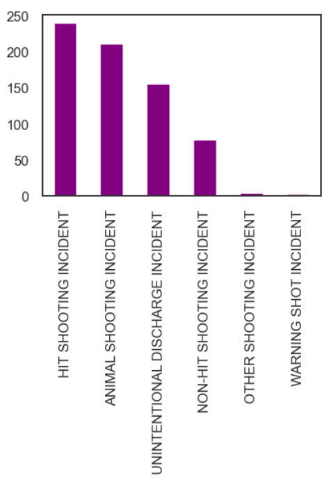

### Features related to shooting incidents  
Since not all shooting incidents are the same, two new features are created. 
  + Any type of animal shooting is kept as a separate feature because that indicates the presence of animals that may not be friendly to human inhabitation. 
  + All other shooting incidents, involving not an animal, are summed up irrespective of whether they resulted in a hit or not. The reason is, any kind of non-animal shooting, including but not limited to, warning shot etc, are equally dangerous. 
  
After the feature creation, the following type of proportion was observed in the dataset:

##### Animal Shooting Episodes across zipcodes  
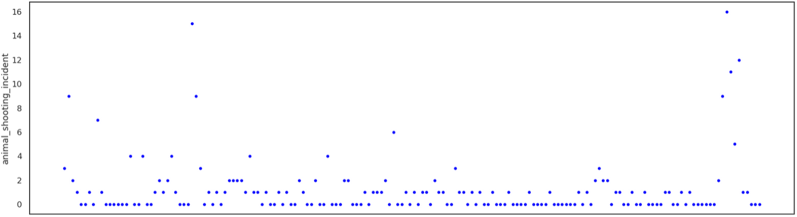

##### Shooting Episodes resulting in Human injury across zipcodes   
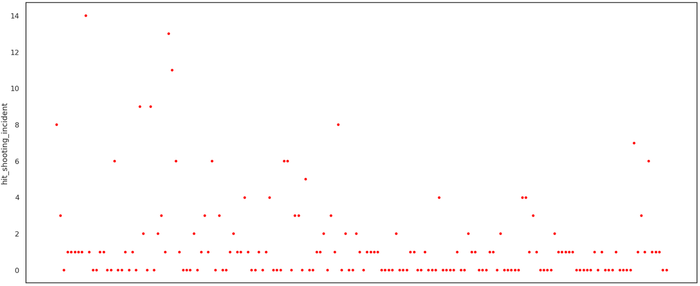

##### All non-animal shooting episodes of concern (human injury, warning shots, and others) across zipcodes   
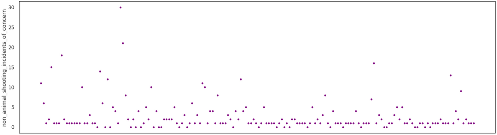

##### All shooting instances as line chart (as a function of zipcode)
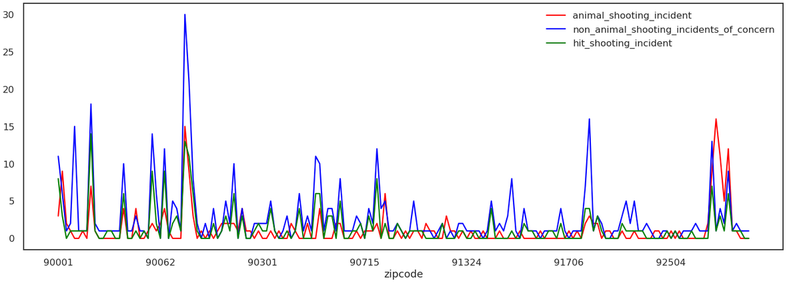

The above charts show there are areas that involve elevated levels of shooting incidents of some kind or other. This could be of concern to the people who like to relocate.

### Features related to neighbourhood:  

The dataset is futher enriched with neighbourhood information as reflected in the following map.  
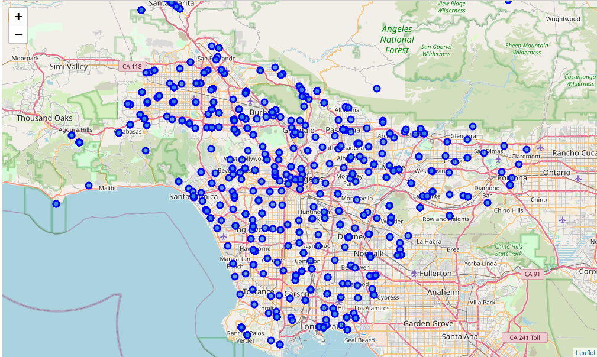

### Features related to venues (businesses, landmarks, institutions, parks, etc) using Foursquare APIs:

Since for relocation assitant we need features such a closeby venues, Foursquare API was used to expand the neighbourhood further into different venues, and aggregate into 10 most common venues.

The following picture shows some of the venues:  

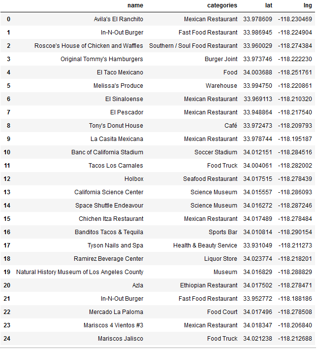

The following bar chart shows the proportion of various avenues in the dataset gathered using Foursquare APIs  

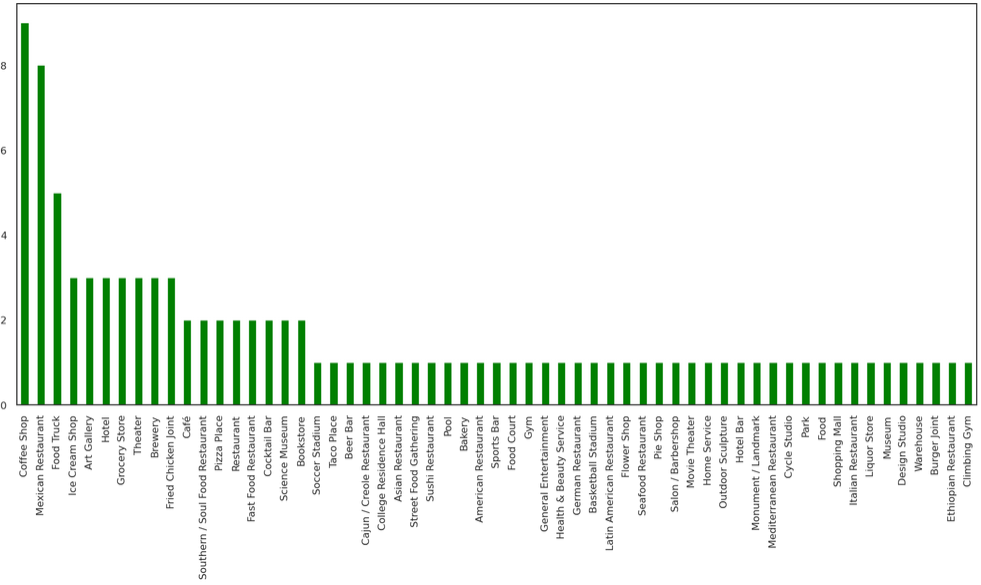  

Using Foursquare APIs totally 269 categories were identified as follows:

`['Grocery Store', 'Burger Joint', 'Pharmacy', 'Sandwich Place','Pizza Place', 'Fast Food Restaurant', 'Shoe Store', 'Donut Shop','Mexican Restaurant', 'Park', 'Cajun / Creole Restaurant','Fried Chicken Joint', 'Coffee Shop', 'Chinese Restaurant','Filipino Restaurant', 'Ice Cream Shop', 'Café', 'Bakery','French Restaurant', 'BBQ Joint', 'Bookstore', 'Plaza','Taiwanese Restaurant', 'Tea Room', 'Shopping Mall','Vietnamese Restaurant', 'Pedestrian Plaza', 'Dim Sum Restaurant','Bar', 'Recreation Center', 'Bubble Tea Shop','Monument / Landmark', 'Italian Restaurant', 'Ramen Restaurant','South American Restaurant', 'Jazz Club', 'Taco Place', 'Spa','Dessert Shop', 'Historic Site', 'Art Gallery', 'Noodle House','Asian Restaurant', 'Seafood Restaurant', 'Record Shop','Thai Restaurant', 'Hotel', 'Motel', 'Gift Shop','Indian Restaurant', 'Basketball Stadium', 'Basketball Court','Concert Hall', 'Stadium', 'Latin American Restaurant','Cocktail Bar', 'Sports Bar', 'Food Truck', 'Hotel Bar','Snack Place', 'American Restaurant', 'Food', 'Pet Store','Hardware Store', 'Kids Store', 'Salon / Barbershop','Cosmetics Shop', 'Clothing Store', 'Supplement Shop', 'Bank','Mobile Phone Shop', 'Furniture / Home Store','Rental Car Location', 'Supermarket', 'Gym', 'Bus Station','Street Food Gathering', 'Candy Store', 'Farmers Market','New American Restaurant', 'Liquor Store', 'Convenience Store','Video Game Store', 'Donburi Restaurant', 'Discount Store','Thrift / Vintage Store', 'Theater', 'Indie Theater','Gym / Fitness Center', 'Lounge', 'Nightclub', 'Rock Club','Cycle Studio', 'Salad Place', 'Japanese Restaurant', 'Office','Toy / Game Store', 'Southern / Soul Food Restaurant','Breakfast Spot', 'Sushi Restaurant','Vegetarian / Vegan Restaurant', 'Comedy Club', 'Music Venue','Movie Theater', 'Wine Shop', 'Multiplex', 'Speakeasy','Gastropub', 'Middle Eastern Restaurant', 'Museum', 'Juice Bar','Shipping Store', 'Astrologer', 'Restaurant', 'Laundromat','Recording Studio', 'Train Station', 'Optical Shop', 'Gas Station','Wings Joint', 'ATM', 'Department Store', 'Intersection', 'Market','Baseball Field', 'Health & Beauty Service', 'Automotive Shop','Laundry Service', 'Mediterranean Restaurant', 'Poke Place','Sporting Goods Shop', 'Doner Restaurant', 'Dumpling Restaurant','Big Box Store', 'Steakhouse', 'Buffet', 'Weight Loss Center','Construction & Landscaping', 'Rental Service', 'Shop & Service','Check Cashing Service', 'Boutique', 'Diner', 'Miscellaneous Shop','Pilates Studio', 'Jewish Restaurant', 'Pool','Lebanese Restaurant', 'Gay Bar', 'Moroccan Restaurant','Afghan Restaurant', 'Indie Movie Theater', 'Food Court','Electronics Store', 'Hawaiian Restaurant', 'Jewelry Store',"Women's Store", 'Fish & Chips Shop', 'Cuban Restaurant','Food & Drink Shop', 'Hookah Bar', 'Performing Arts Venue','Business Service', 'Hobby Shop', 'Korean Restaurant', 'Casino','Dry Cleaner', 'Home Service', 'Storage Facility','Football Stadium', 'Martial Arts School', 'Video Store','Peruvian Restaurant', 'Dive Bar', 'English Restaurant', 'Trail','Frozen Yogurt Shop', 'State / Provincial Park', 'Deli / Bodega','High School', 'Bagel Shop', 'Other Great Outdoors', 'Beer Garden','Arts & Entertainment', 'African Restaurant', 'Music Store','Wine Bar', 'Yoga Studio', 'Smoothie Shop', 'Board Shop','Hot Dog Joint', 'Soup Place', 'Winery', "Dentist's Office",'Gourmet Shop', 'Burrito Place', 'Mongolian Restaurant','Playground', 'Water Park', 'College Cafeteria', 'Disc Golf','Tennis Court', 'Sculpture Garden', 'Shopping Plaza','Karaoke Bar', 'Waterfront', 'Arts & Crafts Store', 'Fabric Shop','Smoke Shop', 'Persian Restaurant', 'Argentinian Restaurant','Flea Market', "Doctor's Office", 'Pool Hall', 'Soccer Field','Creperie', 'Cupcake Shop', 'Greek Restaurant', 'Cheese Shop','Bike Shop', 'Pub', 'Accessories Store', 'Hospital', 'Flower Shop','Light Rail Station', 'Scenic Lookout', 'Campground', 'Newsstand','Shabu-Shabu Restaurant', 'Gymnastics Gym', 'Gun Shop','Auto Garage', 'Photography Studio', 'Bridge', 'Nail Salon','Financial or Legal Service', 'Golf Course', 'Baby Store','Assisted Living', 'Dog Run', 'River', 'Cable Car','Other Repair Shop', 'Cafeteria', 'Falafel Restaurant', 'Track','Skating Rink', 'Gym Pool', 'Brewery', 'Antique Shop','Lingerie Store', 'Garden Center', 'Film Studio', 'Tanning Salon','Massage Studio', 'Theme Park Ride / Attraction', 'Theme Park','Souvenir Shop', 'Fountain', 'Theme Restaurant', 'Tree','Racetrack', 'Tailor Shop', 'Tex-Mex Restaurant', 'Bowling Alley','Indonesian Restaurant', 'Print Shop', 'Motorcycle Shop','Food Service']`

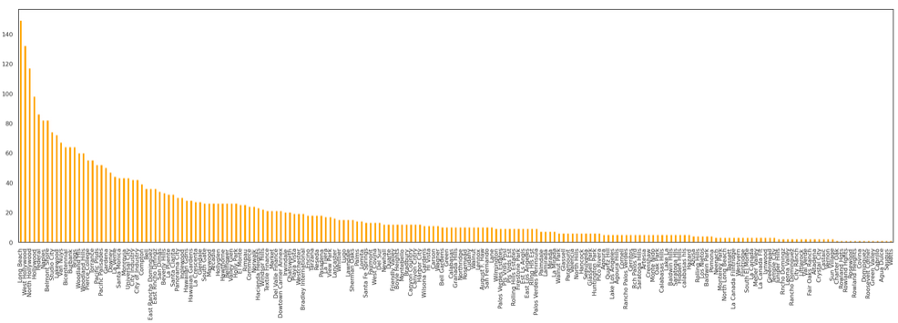  

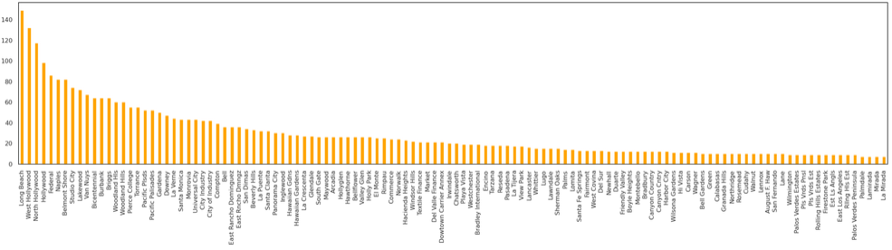  

## Clustering

The final dataset thus created is further processed through clustering algorithm. 

Four different clusters were identified based on various metrics (elbow, silhoutte score etc). The clusters and defined and evaluated based on the top 4 most common venues as discussed in the results section.

The clustering distances are shown below

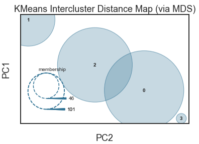  

The Los Angeles neighbourhood map with clusters is shown below:

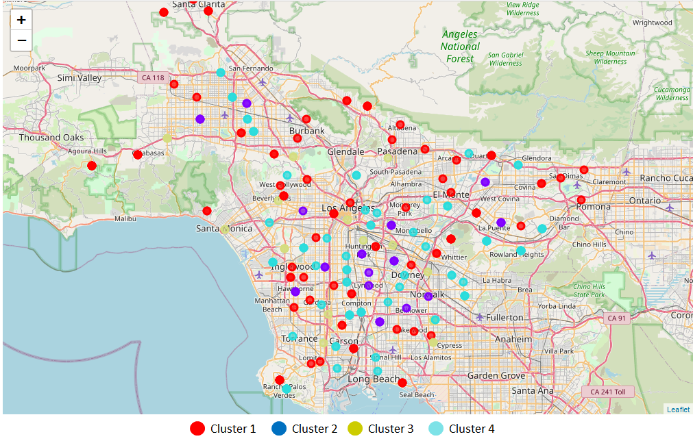  

## Results

| Cluster | Mean Population | Mean Age | Mean Number of Households | Average Household Size | Shooting involving Human injury | Non Animal Shooting Incidents Of Concern | Animal Shooting Incident | 1st Most Common Venue | 2nd Most Common Venue | 3rd Most Common Venue | 4th Most Common Venue |  
| :------------- | :----------: | -----------: | ---------: | ---------: | ----------: | ----------: | ----------: | ----------: | ----------: | ----------: |----------: |
|0|27705|37.60|9390.6|3.0|0.8|1.9|0.8|Trail|Coffee Shop|Park|Park|
|1|79555|30.09|21789.6|3.6|3.4|5.4|5.6|Mexican Restaurant|Mexican Restaurant|Shopping Mall|Pizza Place|
|2|47588|34.83|14497.2|3.3|2.5|5.0|2.3|Mexican Restaurant|Mexican Restaurant|Home Service|Pharmacy|
|3|8896|37.61|2814.5|2.7|1.0|1.7|0.7|Mexican Restaurant|Mediterranean Restaurant|Ice Cream Shop|Yoga Studio|

### Cluster 1

Cluster 1 involves the following 4 most common avenues

