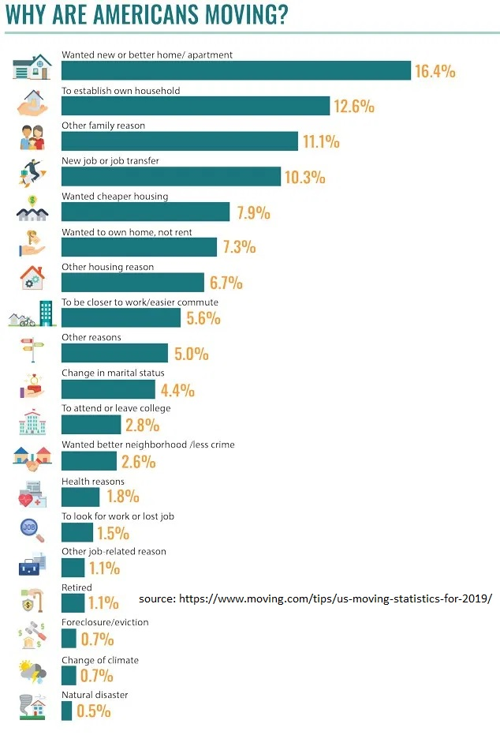

# Relocation assistant - ML based helper for those looking to relocate to Los Angeles County

## Business Problem  
People often relocate to a different area for various reasons. The reason why people move are varied, and the following graphics shows some of the top reasons.

[source: [us-moving-statistics-for-2019](https://www.moving.com/tips/us-moving-statistics-for-2019/)]

[This article based on a survey](https://www.allied.com/infographic/job-relocation-survey) outlines more reasons and factors that govern the job related relocation, and what people look for.

As part of their relocation plans it becomes important for people to explore the area. When people live far away from the places to which they are seeking relocation, it becomes expensive to undertake travel and personally explore the area. Even though the final decision will require them to travel, it will make a lot of sense for them to use a resource (like an application like this, or a human consultant) that can provide useful suggestions about the area and the neibourhood. 

For example, people may want to find out places closer to the schools or shopping malls, or beaches. Individual requirements vary, and hence it will be helpful to have an application that can suggest areas, and also indicate possible cities / neighbourhoods to look for, from the standpoint of efficient exploration. 

Crowd sourcing is one of the best ways to see what kind of people relocate and for what reasons, and how their reasons influence the choice of their neighbourhoods. Some of the criteria are outlined in [this article](https://www.urbanbound.com/blog/crowdsourcing-mobility-the-most-valuable-relocation-data-is-closer-than-you-think)  

This notebook implements **a subset of the requirements** of a typical relocation assistant, by pulling geographical information about LA county and adding additional data for the users to query and decide the location to visit for relocation. For example and illustration, this assignment uses the shooting incidents in LA county as one form of criminal episodes to enrich the dataset.

This notebook, though not a full fledged application, provides a simple prototype for the analytics part of an application. While things like persistence, deploymet, GUI are outside the scope of this exercise, the trained model in this notebook can be deployed and used with real data for a real life application. 

Due to paucity of data available to construct a complete application, this prototype uses selected variables where the data is more or less complete.

## Datasets Used:

- la_county_zipcodes = "https://namecensus.com/igapo/zip_codes/counties/alpha/Los Angeles County-California1.html"
- shooting_incident_report = "https://data.lacounty.gov/Criminal/All-Shooting-Incidents-for-Deputy-Involved-Shootin/d5zc-33fr"
- Zipcode 1 = "https://namecensus.com/igapo/zip_codes/counties/alpha/Los%20Angeles%20County-California1.html"
- Census = "https://catalog.data.gov/dataset/2010-census-populations-by-zip-code"
- Population by Zipcodes = "https://www.zip-codes.com/city/ca-los-angeles.asp
- Latitude / Longitude = "https://gist.githubusercontent.com/erichurst/7882666/raw/5bdc46db47d9515269ab12ed6fb2850377fd869e/US%2520Zip%2520Codes%2520from%25202013%2520Government%2520Data"
- http://download.geonames.org/export/zip/ (downloaded the USZipcodes.zip)  

## Additional datasets referred but not used  

- wikipedia_la_cities = "https://en.wikipedia.org/wiki/List_of_cities_in_Los_Angeles_County,_California"
- Zipcode 2 [not used] = "https://www.laalmanac.com/communications/cm02_communities.php"

## Data Preperation

The essential step of any ML based study is preparation of data. This is key especially when the dataset is sourced from an uncontrolled source such as public data sources. In this case, the followoing data preparation steps were carried out.

  + Removal missing values: Since there is no column or row can be omitted here, and since there is no easy way to impute the missing values, the incomplete rows were dropped in a dataset from a single source. The variables of interest are things like zipcode, latitude, longitude, demographic information such as mean household age, number of males, females etc, population, and shooting incidents. None of these can be easily guessed, or meaningfully interpolated from other values. For instance the population in a zipcode does not have to be similar or more or less than a nearest zipcode; neither does the shooting incidents etc. Since conceptually it is meaningless to pad values this way, a two pronged approach was taken as described below, to deal with rows that are incomplete in a given dataset. 
    * Dropping incomplete rows: Drop the rows (for zipcodes) that have missing values in the required columns
    * Replace with rows from another dataset: Find another public dataset from a different source, that may contain the data for this row (identified by the zipcode) merging both to form a more complete dataset.
    
  + Duplicates:  The duplicates are unavoidable in a public dataset, and especially when crowd sourced datasets are merged together. These duplicates are filtered out by simple removal of the second and following records. An example is shown below
  
  [The following screenshot](!../../images/duplicates_illustration.png) shows the number of rows (980) in a dataframe that contains duplicates and inconsistent entries
  
  
  
## Feature Engineering

Multiple datasets are brought together as outlined in the dataset filed of this report earlier. These datasets are cleansed, merged to form a more complete and unified dataset after the removal of the duplicates.

